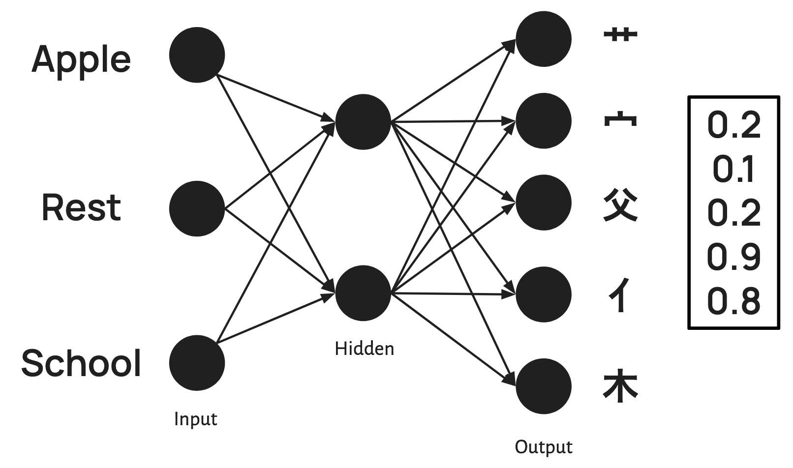
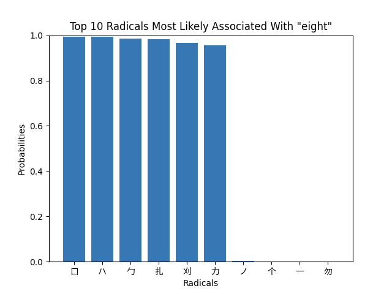

# Kanji Radical Match AI
Match radicals of Japanese (and Chinese) characters that most likely associated with English words—The likeliness of radicals being associated with a single English word / phrase as input.

# Table of Contents
1. [Documentation](#documentation)
   - [How it works](#how-it-works)
   - [Benefits & Further Implementation](#benefits--further-implementation)
   - [Setbacks](#setbacks)
   - [Packages](#packages--version)
   - [Usage Instructions](#usage-instructions)
     - [Recommended Models](#recommended-models)
2. [Results](#results)
3. [Data & References](#data--references)

# Documentation

## How it works
A feedforward neural network used to learn the connections between English to radicals. 
The has an input layer of size over 12,000+ entries representing all the English words or phrases in our provided vocabulary. 
Each English word or phrase was encoded as a one-hot vector, allowing the model to perform its learning.
The model only receives single English word/phrases as inputs where each vector was independently represented with no association with the other vectors.

The figure below is an example of the input-output architecture. (The English and radicals are not made to be a match in this figure).

## Benefits & Further Implementation
- Collect CJK radicals highly correlated to English words via Japanese.
- Find associated radicals on complete English sentences in further implementation.
- Can be further used in NLP as a foundation for English to CJK radical embeddings.

## Setbacks
- This is a lower-level implementation of word embeddings; more embeddings would be considered if we were to make predictions on complete sentences.
- Supports only one token.
- May lose accuracy if additional kanji and radicals are introduced. Additionally accounts for formal versions of kanji such as 'eight' being written as 捌 aside from 八.
- Only trained on Japanese dictionaries.

## Packages & Version

Working versions:
- 3.9.6

| **Package**      | **Import Name** | **Version** |
|------------------|-----------------|-------------|
| PyTorch          | torch           | 2.2.2       |
| Jupyter Notebook | notebook        | 7.0.6       |
| Matplotlib       | matplotlib      | 3.8.1       |
| scikit-learn     | sklearn         | 1.3.2       |

## Usage Instructions
1. Open `main.py` and run it, no arguments are required.
2. To use other models on the file, 
the `load_e2r_model` function should be changed to accommodate a different model path.
The class for instantiating the model should also be used accordingly with the dimensions.

### Recommended Models
- Model V3 - `model_v3_state_dict.pt`
- Model V4 - `model_v4_state_dict.pt`

# Results
The initial model predicted overall lower probabilities across multiple different radicals. 
The most likely associated radical was ハ with an almost 80% likelihood, followed by 目 with an approximately 70% likelihood. 
These probabilities dropped dramatically by the third radical, with 一 and 貝 being predicted with a likelihood of only around 15%, followed by small yet still noticeable probabilities in the bottom 6 radicals. 
If we extended the graph to include the top 20 radicals predicted by that model, we could actually see that these miniscule probabilities seen in the bottom 6 radicals continue across radicals 11 through 20. 
The latest model (V4) consistently predicted much higher probabilities between 1 and 0.9 for only the top 5 radicals. 
Beyond the top 5, the probabilities were close to 0, and this trend continued if we extended the graph to include the top 20 radicals.

# Data & References
- EDRDG, RADFILE/KRADFILE, https://www.edrdg.org/krad/kradinf.html
- kanjivg-radical, https://github.com/yagays/kanjivg-radical
  - Reference for pre-processing data into kanji2radical from KRADFILE
- kanji-data, https://github.com/davidluzgouveia/kanji-data
  - English-Kanji data reference
  - Reference for pre-processing the dictionary data from the kanji JSON files and KRADFILE
- jmdict-simplified, https://github.com/scriptin/jmdict-simplified
  - Preprocessed data from EDRDG
- Noto Sans CJK font, https://notofonts.github.io/noto-docs/specimen/NotoSansCJKtc/

